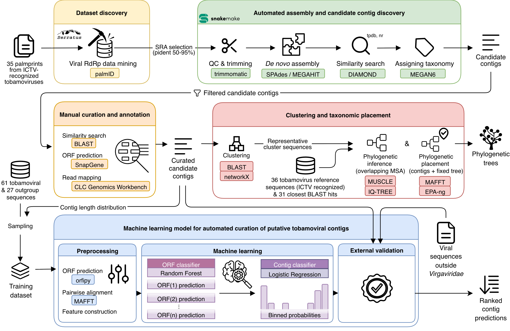

# tobamo-analysis

Dataset discovery, manual curation, clustering/phylogenetic placement, and
machine-learning classification code behind:

> Pajek Arambašič N, Bačnik K, Kranjc L, Vogrinec L, Curk T, Kutnjak D.
> **Data mining of global sequence datasets markedly expands known diversity
> within *Tobamovirus* genus.** Manuscript in preparation.

This is the first of three repos this project's code/data was split into:

1. **tobamo-analysis** (this repo) — dataset discovery (Serratus PalmID
   query → 253 candidate SRRs), the step upstream of the Snakemake pipeline,
   plus everything downstream of it: manual curation, clustering/
   phylogenetic placement, and machine-learning classification.
2. [tobamo-snakemake](https://github.com/nezapajek/tobamo-snakemake) —
   automated assembly and candidate contig discovery (quality control, *de
   novo* assembly, similarity search, preliminary taxonomic assignment) on
   the SRRs selected by `dataset_discovery/` above.
3. [tobamo-supp-data](https://github.com/nezapajek/tobamo-supp-data) —
   supplementary tables, sequence alignments, and the supplementary methods
   document referenced by the article. Archived on Zenodo for a stable,
   citable DOI; not runnable code like the other two.

<p align="center">
  
</p>
Workflow schematic was created with draw.io

## Structure

Mirrors the five-module pipeline in the paper's Figure 1 (the first module,
automated assembly, is `tobamo-snakemake`; the other four live here):

```
tobamo-analysis/
├── dataset_discovery/              # Serratus PalmID hits -> 253 selected SRRs
├── manual_curation_annotation/     # Snakemake output -> 510 curated candidate contigs
├── palmprint/                      # viral palmprint (RdRp) domain identification
├── clustering_taxonomic_placement/ # clustering + phylogenetic placement of novel contigs
├── machine_learning/               # two-stage ORF/contig classifier
└── data/                           # shared curated datasets and reference collections
```

- **`dataset_discovery/`** — Serratus PalmID search with 35 ICTV-recognized
  tobamovirus palmprints against all SRA short-read datasets (6,870 hits),
  filtered to `50 < pident < 95` → 253 candidate SRRs.
- **`manual_curation_annotation/`** — narrows the Snakemake pipeline's raw
  output (2,567 contigs) down to 510 curated candidate contigs (control-SRR
  removal, dedup, cellular-organism removal, one anomalous-dataset
  exclusion), then supports domain-expert manual labeling into six
  categories (known/novel/divergent tobamoviral, related/unrelated other
  viruses, misassembled).
- **`palmprint/`** — palmprint (RdRp) domain identification via ORF
  prediction + PalmScan; not a named module in the paper's figure, but
  informative for the "why" behind curation and the ML classifier's feature
  design.
- **`clustering_taxonomic_placement/`** — BLAST+NetworkX clustering of novel
  tobamoviral contigs, then MAFFT+EPA-ng phylogenetic placement onto a fixed
  reference tree (external MEGA11/MUSCLE/trimAl/IQ-TREE tree-building step
  not included — done by another researcher).
- **`machine_learning/`** — two-stage supervised classifier (Random Forest
  ORF classifier → Logistic Regression contig-level aggregation via stacked
  generalization) that automates curation of new candidate contigs; ~0.974
  cross-validation accuracy, ~0.899 AUC on this study's discovered contigs.
- **`data/`** — shared curated datasets (contigs, reference sequences, domain
  scientist-provided ground truth/annotations) consumed by the modules above.

Each subfolder has its own `README.md` with setup/usage details.

## Environment setup

There is no single environment for the whole repo — most subfolders assume
their own conda environment (or system tools) is already active, and don't
set it up for you. Before running notebooks/scripts anywhere in this repo,
check the relevant subfolder's `README.md` for what it expects. As a
starting point:

- **`dataset_discovery/`, `manual_curation_annotation/`, `data/`, and the
  ORF-prediction (`orfipy`) step of `palmprint/`** — covered by the general
  environment at the repo root:
  ```bash
  conda create --name tobamo-analysis --file analysis_conda-requirements.txt  # linux-64 only
  # or, cross-platform but less pinned:
  pip install -r analysis_requirements.txt
  ```
- **`clustering_taxonomic_placement/clustering/`** — own env, see
  [`clustering/clustering_env.yaml`](clustering_taxonomic_placement/clustering/README.md#installation).
- **`clustering_taxonomic_placement/phylogenetic_placement/`** — own env,
  see [`phylogenetic_placement/environment.yml`](clustering_taxonomic_placement/phylogenetic_placement/README.md).
- **`machine_learning/`** — own env (`tobamo-model`), see
  [`machine_learning/analysis_environment.yml`](machine_learning/README.md#1-installation).
- **`palmprint/`** — needs `getorf` (EMBOSS, via conda) or `orfipy` (in the
  root env above) for ORF prediction, plus Docker for PalmScan itself —
  see [`palmprint/README.md`](palmprint/README.md#prerequisites).

## License

MIT — see `LICENSE`.
