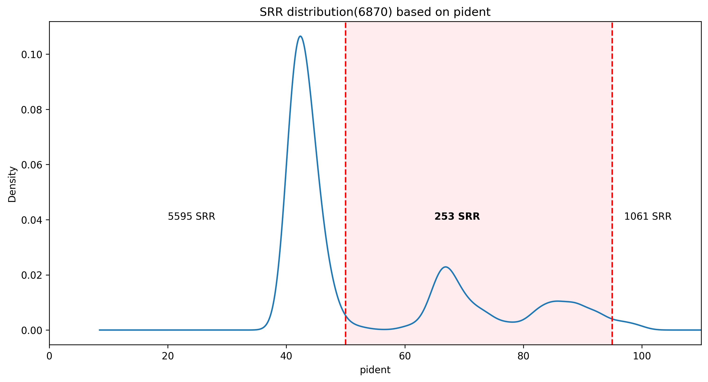

# Dataset Discovery

**Purpose:** Identify candidate SRA datasets likely to contain novel
tobamoviruses, using the [Serratus](https://serratus.io) PalmID tool to mine
all short-read datasets in the SRA for hits to conserved RdRp palmprint
domains.

## Workflow

1. Query Serratus PalmID with RdRp amino acid sequences from 35 of the 37
   ICTV-recognized *Tobamovirus* species (obtained March 2022; tobacco latent
   virus and maracuja mosaic virus excluded — no usable RdRp sequence). The
   input FASTA sequences and resulting palmprints are in
   [`PalmD_tobamo_input_sequences.tsv`](PalmD_tobamo_input_sequences.tsv).
2. For each unique run ID / palm ID pair, keep only the highest-identity hit
   (`serratus_output_combined_S3.csv`, 136,965 rows — one row per
   run/palmprint alignment; this is the same data as
   [Supplementary Table S3](https://github.com/nezapajek/tobamo-supp-data/blob/main/supplementary_data/Supplementary_table3.tsv),
   modulo formatting — the supp-data copy has been through an Excel
   round-trip, giving it comma decimals and non-ISO dates).
3. Filter to hits with `50 < pident < 95`: high enough to be a real
   palmprint-domain match, low enough to exclude near-identical sequences of
   already-known tobamoviruses. This yields 253 SRRs of interest.
   Implemented in [`filter_results.ipynb`](filter_results.ipynb), which also
   plots the pident distribution with the selection band highlighted
   (`pident_distribution.png`) and writes the selected run IDs to
   `samples.tsv`.
4. Download the selected datasets with `fasterq-dump` — this step is not in
   this repo; it's `workflow/scripts/download_sra.sh` in
   [tobamo-snakemake](https://github.com/nezapajek/tobamo-snakemake), run
   directly against `samples.tsv` (copy or point it at this file).

`samples.tsv` is the final 253-SRR selection and feeds directly into the
Snakemake pipeline in
[tobamo-snakemake](https://github.com/nezapajek/tobamo-snakemake) for
automated assembly and candidate contig discovery.

  

