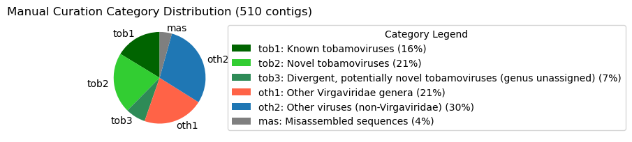

# Manual Curation and Annotation

**Purpose:** Take the raw Snakemake pipeline output (all assembled contigs
across the 253 selected SRRs) and narrow it down to a clean, deduplicated,
non-cellular candidate set — the input to `clustering_taxonomic_placement/`
and `machine_learning/` — then support the domain-expert manual curation and
labeling of those candidates.

## Notebooks

### `notebooks/filtering_snakemake_contigs.ipynb`

Filters the Snakemake pipeline's combined MEGAN6 output down to the curated
candidate set, in order:
1. Keep only the 253 selected SRRs. The Snakemake output still contains the
   control SRRs used to validate the pipeline itself — this step is
   just bookkeeping to align it with `samples.tsv`; those SRRs were never
   part of the 253-SRR selection and aren't used anywhere downstream.
2. Detect and remove duplicated contigs (same underlying dataset submitted
   under multiple SRA accessions) — 6 SRRs removed after manual metadata
   inspection.
3. Remove contigs classified as *cellular organisms* by MEGAN taxonomy.
4. Remove the SRR6846476 dataset (manually flagged as anomalous — chimeric
   sequences, unusually short contigs).
5. Write out the resulting FASTA files to `../data/contigs/`.

Ends at **510 curated candidate contigs from 131 SRRs** — this is the set the
paper reports manual curation was performed on.

**Input:** `../../tobamo-snakemake` pipeline output (`results/megan6_results_combined.csv`,
assumed at a sibling checkout — this file is the raw, un-filtered Diamond+MEGAN6
table across *every* sequenced SRR, including control/debug samples; regenerate
it by running tobamo-snakemake over `../dataset_discovery/samples.tsv`, then
adjust the path in the notebook's first cell if your checkout lives elsewhere).

### `notebooks/metadata_analysis.ipynb`

Fetches SRA metadata for the 253 selected SRRs (loaded directly from
`../dataset_discovery/samples.tsv` — the pident 50–95% selection itself is
derived once in `dataset_discovery/filter_results.ipynb`, no need to
recompute it here), then cross-checks it against the curated 510-contig set
and the domain-expert category annotation
(`../data/domain_sci_input/Contigs_SRR_metadata.xlsx`).

`results/metadata.csv` is the same 253-row metadata later published as
`Supplementary_table4.tsv` in `tobamo-supp-data` (modulo tsv/csv formatting).

## Manual curation and annotation (domain-expert work, no code)

Beyond the filtering and metadata steps above, the bulk of the work described
in this directory's name was performed directly by domain scientists —
BLAST searches, visual inspection, and ORF annotation done outside of any
notebook. It's documented here for completeness, not reproducibility.

**Classification.** Each of the 510 curated candidate contigs was inspected
against separate BLASTN (NCBI nt, April 2025; e-value 0.05, word size 11,
gap open 5, gap extend 2) and BLASTX (NCBI nr, April 2025; e-value 0.05,
word size 5, gap open 11, gap extend 1, matrix BLOSUM62) searches, then
assigned to one of six categories based on sequence identity to known
tobamoviruses:

- **tob1** — sequences of known tobamoviruses
- **tob2** — sequences of novel tobamoviruses
- **tob3** — highly divergent, potentially novel tobamoviruses, where genus
  could not be assigned from sequence similarity of partial-genome contigs
- **oth1** — sequences related to other genera within *Virgaviridae*
- **oth2** — sequences belonging to other viruses unrelated to *Virgaviridae*
- **mas** — misassembled sequences

For contigs suspected of being misassembled (**mas**), reads were mapped back
with CLC Genomics Workbench (v25.0.3; QIAGEN) — length fraction 0.9,
similarity fraction 0.9, match score 1, mismatch cost 1 — and the mappings
were visually inspected to confirm misassembly. For **tob3** contigs, genome
organization was additionally examined for consistency with typical
tobamovirus genome architecture.

**ORF prediction and annotation.** For putative novel tobamoviruses
(**tob2** and **tob3**), open reading frames were predicted with SnapGene
(v7.2.1): minimum ORF length 75, start codon ATG required except at DNA
ends. Each predicted ORF was searched against the non-redundant protein
database (BLASTP, NCBI nr, July 2025, same search parameters as above) to
inform contig annotation. Completeness, length, and presence of start/stop
codons were recorded for every predicted ORF, along with any sequence
abnormalities (e.g. missing stop codon, ambiguous start codon, interrupted
sequence) possibly caused by sequencing or assembly errors — see
Supplementary Table S3 (`notes` column for abnormalities).

**Outcome.** Of the 510 curated contigs, 228 (45%) were classified as
tobamoviral (tob1 + tob2 + tob3); the remainder fell into oth1, oth2, or
mas. Table 1 in the paper summarizes the manual curation results, including
notable observations on tobamovirus-like contigs and other viral groups.

*(generated in `notebooks/manual_curation_categories.ipynb` from
`../data/domain_sci_input/ground_truth_final_added_categories.xlsx`)*

## `results/`

Small pre-generated outputs consumed/produced by the two notebooks above:
SRA metadata for the 253 selected SRRs, that same metadata flagged with which
SRRs made it into the final 510-contig set, the metadata used for the
manual dedup decision, and the category distribution pie chart embedded
above. Regenerate via the notebooks if needed — the `SRAweb()` metadata
fetch cells are commented "RUN ONLY ONCE" since they hit the SRA API.
